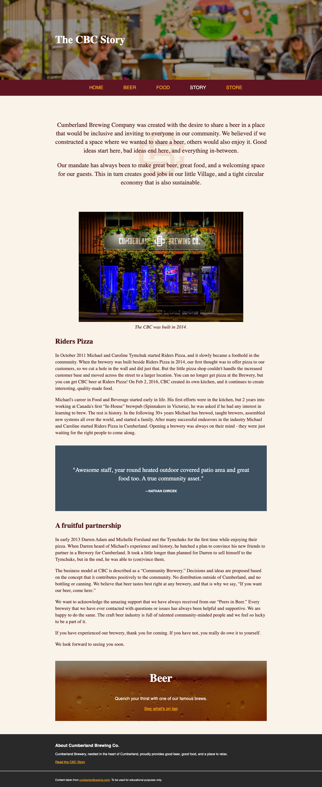

# CSS Essentials

## Objectives
The provided code is the HTML and CSS for the home page and story page of a website inspired by a local company. However, the CSS is missing all of its selectors! You need to figure out which HTML elements to apply each style rule to, so that your finished website looks like the images below. After that, you will write some HTML and CSS of your own.



## Instructions
Remember to:
* Regularly save your files and check out what your web page looks like in a web browser.
* Make regular commits and label them appropriately to document your progress.
### Step 1: Get set up
* Clone your remote exercise repository onto your local machine.
* Add a comment in the head element of the homepage including: the course code and your section number - your name - Exercise 3. Example:
```
<!-- DGL 103 CVS1 - your name - CSS Essentials -->
```
### Step 2: Add the selectors
Note: The syntax of a CSS comment is different to the syntax of an HTML comment.<br>
Read through the HTML files and the CSS file and compare them to the images of the finished webpages to figure out how to replace the comments in the stylesheet with appropriate selectors. You may need to use class, element (type), descendant or combination selectors. There are many different correct ways that you could complete this exercise.<br>
Pay attention to how CSS comments were used to identify and organise different groups of style rules. Adding organizational comments doesn't affect the code, but it helps you keep your CSS tidy and easier to read. Only replace the comments that indicate where a selector should be. Example: 
```
/* all the paragraphs */ {
  color: red;
}
```
The above CSS comment might be replaced with:
```
p {
  color: red;
}
```
Note: The provided code includes HTML elements and CSS properties that you haven't learned about yet. That's ok because this exercise is about understanding the relationships between the elements and the syntax of the selectors. You don't need to understand all the code to be able to complete the exercise.

### Step 3: Write your own code
* Add a new block of content at the bottomo f the homepage. You will need to write the content and the HTML yourself. Include at least four different types of HTML elements in your new block of content.
* Style your new content using all of the following:
    * An ID selector
    * A class selector
    * A descendant selector
    * An internal (embedded) style rule
    * An inline style rule

### Step 4: Format and Add comments 
* Use the Prettier VSCode extension to format your code.
* Add a few comments to explain your HTML and CSS code and highlight anything of interest.

### Step 5: Check for errors
* Use the VSCode HTMLHint extension and validate your HTML code to make sure that it is correct: https://validator.w3.org/#validate_by_upload. Take a screenshot of the results.
* Validate your CSS code to make sure that it is correct: https://jigsaw.w3.org/css-validator/ for CSS. Take a screenshot of the results.

**You have now completed your exercise but you still need to push your edits to GitHub and submit it in Brightspace. Make sure to follow the instructions in the How to Complete Your Exercises Guide.**
